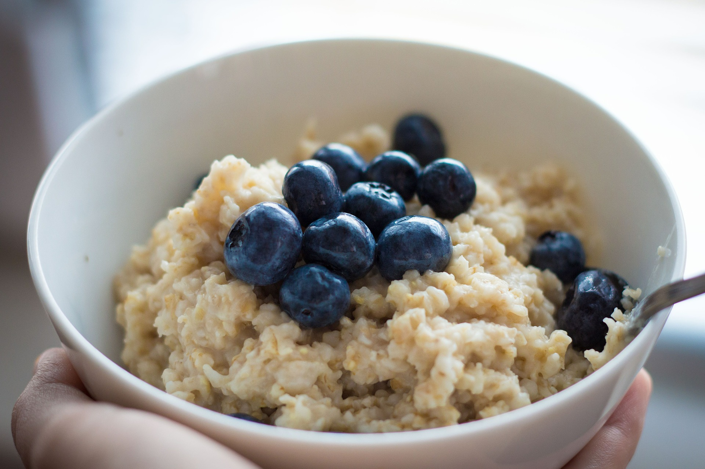

# About Goldydocs

> A sample site using the Docsy Hugo theme.

---

LLMS index: [llms.txt](/llms.txt)

---

<link rel="preload" as="image" href="/about/featured-background_hu_d832a555129eb999.jpg" media="(max-width: 1200px)">
<link rel="preload" as="image" href="/about/featured-background_hu_bca937a8ca79e11c.jpg" media="(min-width: 1200px)">

<section id="td-cover-block-0" class="row td-cover-block td-cover-block--height-auto td-below-navbar js-td-cover td-overlay td-overlay--dark -bg-dark" >
  

    

      

        <h1 class="display-1 mt-0 mt-md-5 pb-4">About Goldydocs</h1>
        

          

<!-- prettier-ignore -->
A sample site using the Docsy Hugo theme.
{.display-6}

      

    

  

  
</section>

<section class="row td-box td-box--white position-relative td-box--height-auto">

Goldydocs is a sample site using the [Docsy](https://github.com/google/docsy)
Hugo theme that shows what it can do and provides you with a template site
structure. It’s designed for you to clone and edit as much as you like. See the
different sections of the documentation and site for more ideas.

</section>

<section class="row td-box td-box--2 td-box--height-auto">
  

    

      
      

This is another section with center alignment

  

</section>

<section class="row td-box td-box--3 td-box--height-auto">
  

    

      
      

This is another section with default alignment

  

</section>

